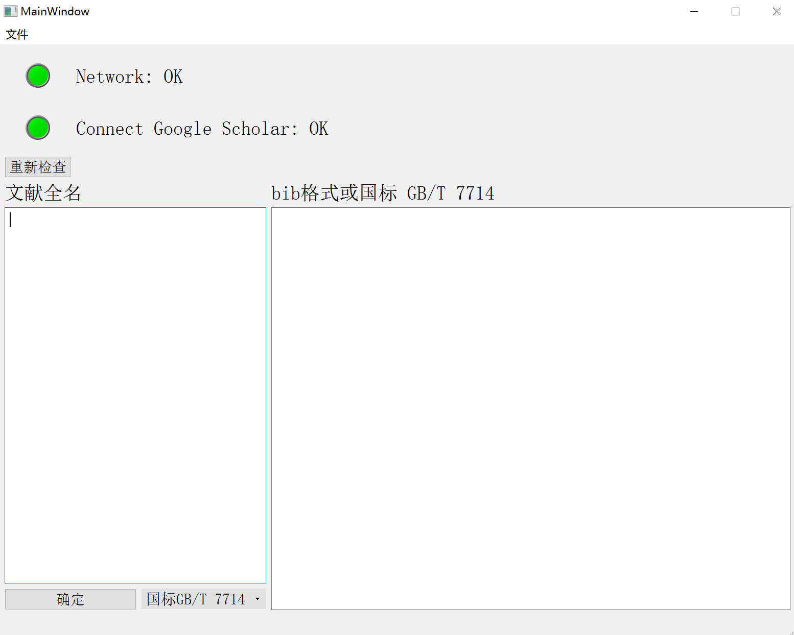
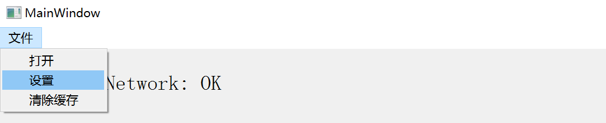
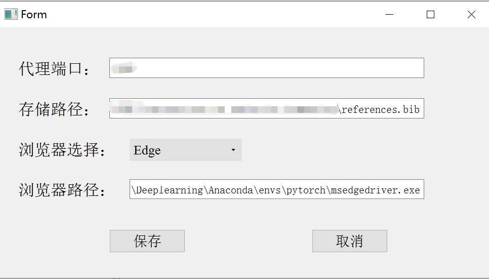
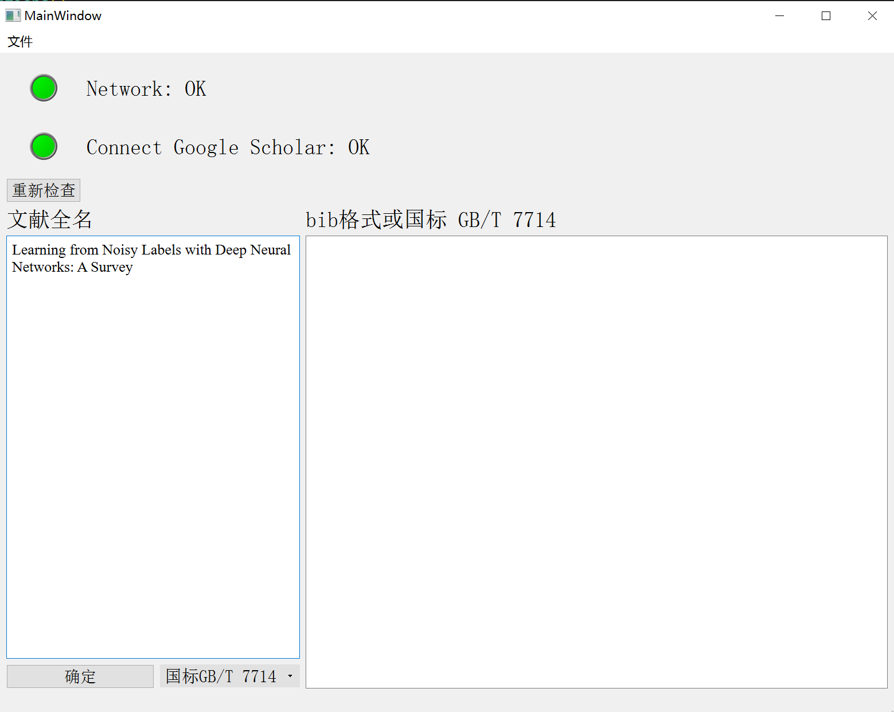
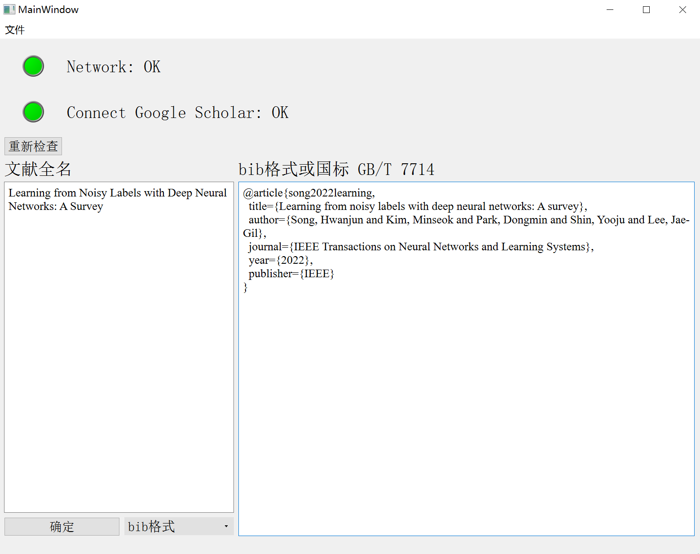
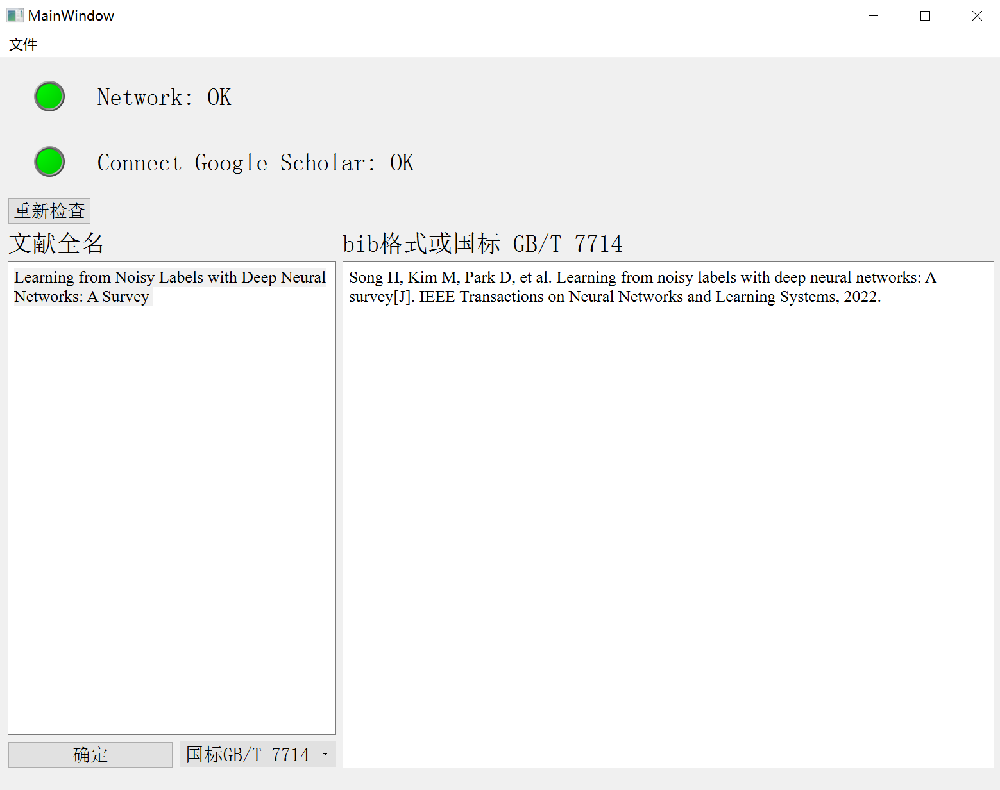

# 自动获取bib格式的文献引用
基于 Selenium 库的文献格式自动获取工具

## 1.使用方法
+ 初次使用时请点击右上角 **文件->设置->**

+ 设置界面可以设置代理端口、存储路径（直接将找到的每一个bib格式放到指定的.bib文件里）、选择浏览器（本人用Edge）、对应浏览器的.exe文件（Selenuim需要）

+ 两个灯分别用来指示网络状况、连接到Google学术的状况，若是出错了可以点击重新检查，建议是两个灯都为绿色再进行下一步操作
+ 输入文献名（最好是全名，方便查找）

+ 输入完成点击确定后，等一下下就可以得到指定文献的bib格式了

+ 也可以在确定按钮旁边选择国标GBT 7714的格式（这个没有存储到指定的文件）

## 2.注意
如果报错，请先检查网络设置，
+ 若网络设置okay，请手动在浏览器登录Google scholar，检查IP是否被封
+ **请定期更新对应浏览器的.exe文件，确保版本匹配指定浏览器**
+ Edge浏览器的msedgedriver.exe下载地址：
  https://developer.microsoft.com/en-us/microsoft-edge/tools/webdriver/